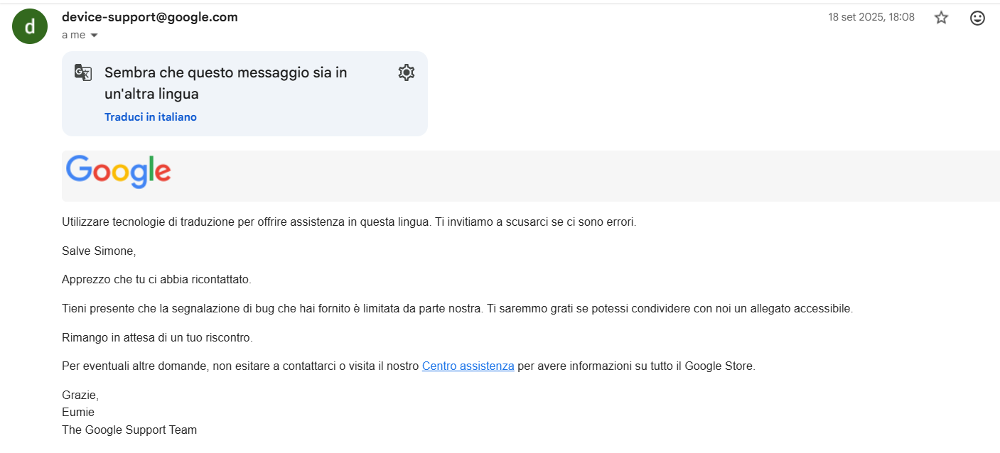

# Bluetooth mouse crashes Google Pixels 9

Research and report by **Simone Biondi**

---
**Affected product:** Android Smartphones 

**Version:** Android 16 - September 2025 "Material 3 Expressive" release (QPR1)

**Bug:** Bluetooth mouse crashes the phone when try to unlock it with face

# Summary

I use a bluetooth mouse for operating with my Google Pixel 9. With the update to Android 16 Sep 25, the interaction between cursor and unlock screen with face screen will crash the phone.

**Steps to reproduce**

1. Open an app that required Unlock with face
2. Wait for popup to confirm the unlock
3. Move cursor inside the popup

Screen will become total black for few seconds and then the smartphone will reboot.

Es. Microsoft Authenticator 

Open Authenticator and try to unlock it

Move cursor inside popup (apps don't allow screenshots on popup, so it doesn't appear)

Black screen will become!

# Bug report

Since this was not a security issue I opened a ticket on September 2025, following their bug report policy. After a few days I was contacted by Google Dev Team

After some emails they asked me the full   generated by the bug and I sent it to them.
