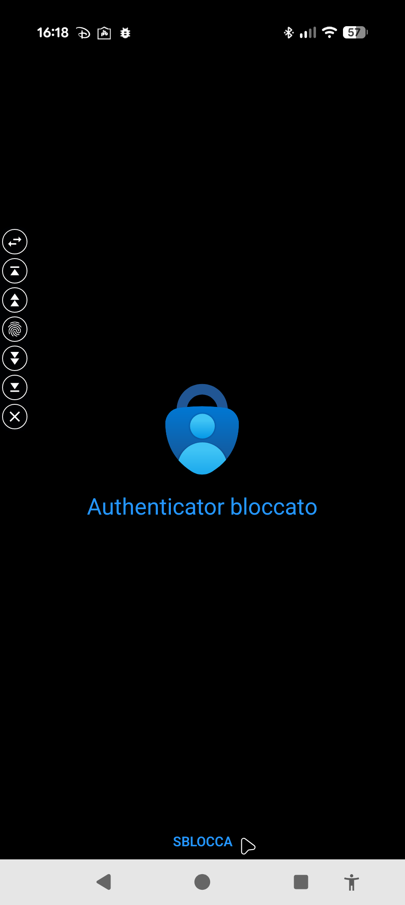
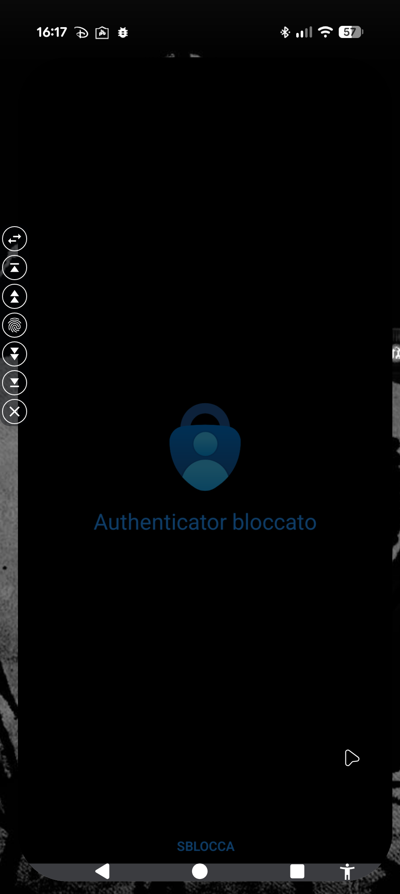

## Bluetooth mouse crashes Google Pixels 9

I use a bluetooth mouse for operating with my Google Pixel 9. With the last update the interaction between cursor and unlock screen with face screen will crashes the phone.

**Steps to reproduce**

1. Open an app that required Unlock with face
2. Wait for popup to confirm the unlock
3. Move cursor inside the popup

Screen will become total black for few seconds and then the smartphone will reboot.

Es. Microsoft Authenticator 

Open Authenticator and try to unlock it

Move cursor inside popup (apps don't allow screen on popup, so it doesn't appear)

Black screen will become!

**Bug report**

Since this was a security issue I opened a ticket following their bug report policy. After a few days I was contacted by Google Dev Team

After some emails they asked me the full   generated by the bug and I sent it them.

Maybe they are fixing it, I hope. We will see in the next releases!
